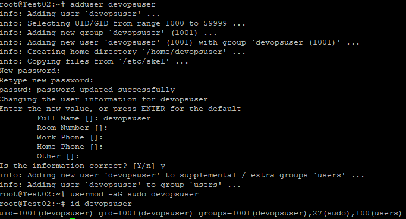
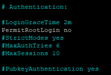
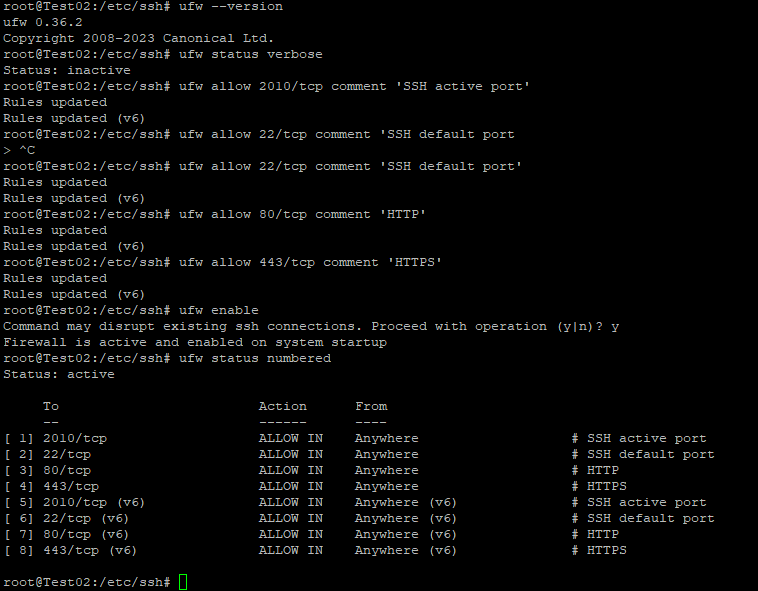
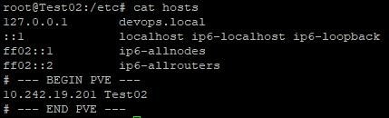

## Architecture Overview

- **Nginx** : Reverse proxy (public access, port 80)
- **Python HTTP Server** : Dummy backend (port 9000, internal only)
- **Node.js Docker App** : Containerized app (port 8000, internal only)
- **Domain access only** : `devops.local`

Backend **tidak dapat diakses langsung via public IP**, hanya melalui reverse proxy.

---


## Repository Structure

```text

|-- README.md
|-- build
|   |-- Dockerfile
|   `-- app
|       `-- index.js
|-- deploy.sh
|-- docker-app
|   |-- Dockerfile
|   `-- app
|       `-- index.js
|-- docs
|   `-- screenshots
|       |-- curl_domain.png
|       |-- curl_ip_public.png
|       |-- docker_ps.png
|       |-- docker_status.png
|       |-- gitstatus.png
|       |-- nginx_status.png
|       |-- task1-firewall_status.png
|       |-- task1-hosts.png
|       |-- task1-id_devopsuser.png
|       |-- task1-sshd_config.png
|       |-- task2-nginx_enable.png
|       |-- task2-nginx_reverse_proxy.png
|       |-- task2-nginx_test.png
|       |-- task2-port_pyhton.png
|       |-- task3-port_nodejs.png
|       |-- task4-first_run.png
|       `-- task4-second_run.png
|-- nginx
|   `-- devops.local.conf
`-- src
    `-- version.txt


================================================

### TASK 1  Server Hardening
### Objective

Mengamankan server sebelum aplikasi dijalankan.

### Implementation

1. Membuat user non-root devopsuser



2. Nonaktifkan login SSH untuk root


3. Enable firewall (UFW)


3. Add Domain devops.local


==============================================

### TASK 2  Reverse Proxy & Dummy Backend
### Objective

Menggunakan Nginx sebagai reverse proxy agar backend tidak diekspos langsung.

### Implementation

Nginx listen di port 80

Python HTTP server di port 9000

Backend hanya bisa diakses melalui domain

Contoh konfigurasi:

===========================================

### TASK 3  Dockerized Node.js Application
### Objective

Menjalankan aplikasi Node.js dalam container Docker.

### Implementation

Menggunakan base image node:20-alpine

Aplikasi expose port 8000

Container berjalan menggunakan host network

Aplikasi tidak dapat diakses langsung dari public IP

Proof

==========================================

### ASK 4 â Manual CI/CD (deploy.sh)
### Objective

Membuat pipeline deployment sederhana tanpa menggunakan tools CI/CD.

### Implementation

Script deploy.sh melakukan:

Update source (dummy)

Build Docker image

Stop & remove container lama

Menjalankan container baru

Script ini bersifat idempotent, dapat dijalankan berkali-kali tanpa error.

### Proof  First Run


### Proof  Second Run


==========================================

# Conclusion

- Seluruh requirement pada technical test telah diimplementasikan dengan baik:

- Server aman

- Backend tidak terekspos langsung

- Aplikasi ter-containerize

- Deployment dapat diulang (idempotent)

- Dokumentasi lengkap dan terstruktur


